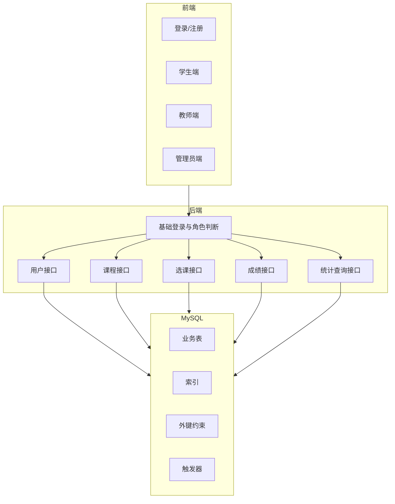
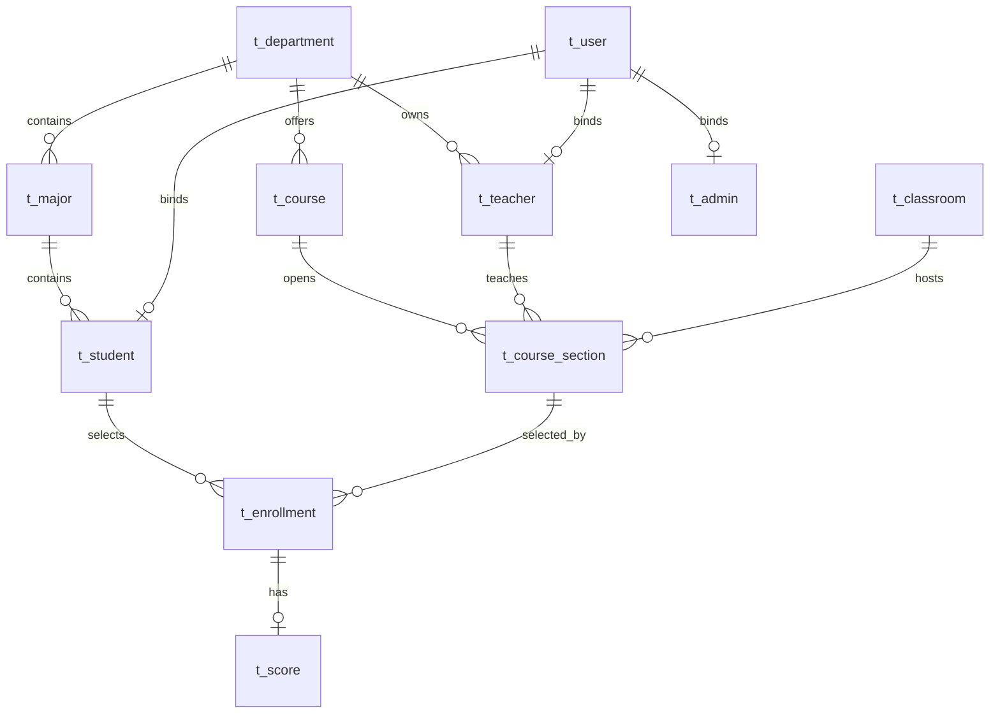

# 学生选课管理系统技术改进文档

文档版本：v1.0  
编写日期：2026-05-05  
适用项目：course-manage-system  
计划周期：约 3 周  
团队规模：4 人  
团队阶段：大二课程项目团队  

## 1. 文档概述

### 1.1 编写目的

本技术文档用于指导团队在接下来约 3 周内对现有学生选课管理系统进行集中改进，使项目更符合 `DBMS Project Requirement.pdf` 中对数据库管理系统课程项目的要求。

考虑到团队成员为大二学生，本文档采用“课程项目可落地”的标准，而不是企业级系统标准。优先保证数据库设计、数据规模、SQL、性能测试、报告和答辩这些直接影响评分的内容；安全、架构分层和复杂工程化改造只做必要增强。

当前项目已经具备学生、教师、管理员三类角色，以及课程管理、选课退课、成绩管理、用户管理等基础功能。但从课程评分重点看，数据库设计、数据规模、索引性能、规范化证明、触发器和报告材料仍需补强。

本文件重点解决以下问题：

- 明确项目还需补齐的功能和数据库能力。
- 给出三周开发排期和四人分工。
- 规划数据库结构升级、数据生成、性能测试和报告材料。
- 定义验收标准，避免最后阶段只停留在页面演示。

### 1.2 参考规范

本文档结构参考了技术文档常见写法：先说明目标受众和范围，再展开系统架构、功能模块、技术实现、部署运维、审核更新和附录。

参考资料：

- 技术文档怎么写：从结构设计到内容编写的全部指南  
  https://blog.csdn.net/2302_79546368/article/details/144277164
- `DBMS Project Requirement.pdf`
- 当前项目源码、SQL 脚本和 README

### 1.3 目标受众

| 读者 | 关注内容 |
| --- | --- |
| 组内开发成员 | 任务边界、代码修改范围、数据库改造方案、接口改造要求 |
| 组长/项目协调者 | 三周进度、验收标准、风险项、成员贡献记录 |
| 报告编写成员 | ER 图、函数依赖、范式分析、SQL 说明、性能测试材料 |
| 答辩成员 | 系统亮点、数据库设计、索引优化、触发器、演示路线 |

### 1.4 文档范围

本文档覆盖：

- 项目现状评估
- 需求差距分析
- 改进目标
- 数据库设计升级方案
- 后端接口改进方案
- 前端功能改进方案
- 数据生成与性能测试方案
- 三周排期
- 四人分工
- 验收标准

本文档不直接替代最终课程报告，但可作为最终报告和答辩 PPT 的技术依据。

## 2. 项目现状

### 2.1 技术栈

| 层级 | 当前技术 |
| --- | --- |
| 前端 | Vue 3、Vite、Element Plus、Vue Router、Axios |
| 后端 | Spring Boot、MyBatis Plus、MySQL Connector、Knife4j |
| 数据库 | MySQL |
| 构建工具 | Maven、npm |

### 2.2 当前主要功能

系统当前已有三类用户：

- 学生：课程浏览、选课、退课、我的课程、成绩查询、个人信息维护。
- 教师：课程管理、成绩录入和修改、个人信息维护。
- 管理员：学生管理、教师管理、课程管理、数据概览。

当前主要接口包括：

- `/api/user/login`
- `/api/student/selectAll`
- `/api/student/register`
- `/api/student/update`
- `/api/teacher/selectAll`
- `/api/teacher/register`
- `/api/course/selectAll`
- `/api/course/insert`
- `/api/score/insert`
- `/api/score/update`
- `/api/score/selectByStudentId`

### 2.3 当前数据库表

当前 SQL 中主要表如下：

| 表名 | 用途 | 主要问题 |
| --- | --- | --- |
| `t_user` | 登录账号和角色 | 密码明文存储，缺少创建时间、状态等字段 |
| `t_student` | 学生信息 | 字段过少，难以支撑真实业务 |
| `t_teacher` | 教师信息 | 字段过少，缺少院系等关联 |
| `t_admin` | 管理员信息 | 字段过少 |
| `t_course` | 课程信息 | 可补充课程类别、容量、上课时间、教室等 |
| `t_score` | 选课和成绩记录 | 同时承担选课表和成绩表职责，语义混杂 |
| ` t_course_and_student` | 课程学生关联 | 表名带前导空格，当前业务基本未使用 |

### 2.4 与课程要求的差距

| 要求 | 当前状态 | 结论 |
| --- | --- | --- |
| 至少 8 个页面 | 已超过 8 个页面 | 基本满足 |
| 注册和登录 | 后端有注册接口，前端以管理员创建用户为主 | 部分满足 |
| 至少两类用户 | 已有学生、教师、管理员 | 满足 |
| 至少四个完整功能 | 已有选课、退课、成绩、用户管理等 | 满足 |
| ER 图至少 8 个实体、6 个关系 | 当前实体不足，关系约束不足 | 不满足 |
| 平均每表不少于 5000 条记录 | 当前只有少量测试数据 | 不满足 |
| 至少两张表超过 50000 条记录 | 当前没有 | 不满足 |
| 插入小于 1 秒，删除/查询小于 2 秒 | 缺少大数据量测试和证明 | 证据不足 |
| 创建索引加速查询/删除 | 索引较少 | 不足 |
| 逻辑设计满足范式 | 缺少函数依赖和范式证明 | 证据不足 |
| 报告包含 ER、FD、Schemas、SQL 解释等 | 当前 README 不完整 | 不满足 |
| 触发器加分 | 当前没有触发器 | 不满足 |

## 3. 改进目标

### 3.1 总体目标

在三周内把项目从“基础课程管理原型”提升为“满足 DBMS 课程项目要求的数据库应用系统”。

具体目标：

1. 数据库实体不少于 8 个，关系不少于 6 个。
2. 增加外键、唯一约束、检查约束、索引和至少 1 个触发器。
3. 生成满足课程要求的数据量：平均每表不少于 5000 条记录，至少两张表超过 50000 条记录。
4. 完成插入、删除、查询性能测试，并保留测试脚本和测试结果。
5. 修复关键接口不一致、页面乱码和明显 bug。
6. 补齐最终报告所需的数据库设计、函数依赖、范式分析和主要 SQL 说明。

不建议三周内追求完整企业级权限系统、复杂微服务架构或大规模重构。项目的核心评分点仍然是数据库设计和数据库实现。

### 3.2 优先级

| 优先级 | 内容 | 原因 |
| --- | --- | --- |
| P0 | 数据库实体、关系、数据规模、性能证明 | 数据库实现占总评分 40% |
| P0 | 最终报告材料 | 报告占总评分 30% |
| P1 | 接口修复、基础权限判断、密码风险说明 | 影响系统完整性和答辩可信度 |
| P1 | 触发器和索引优化 | 可支撑加分和性能指标 |
| P2 | UI 文案乱码、页面体验优化 | 影响演示效果，但不是最高风险 |

## 4. 系统架构设计

### 4.1 当前架构

### 4.2 建议改进后架构

### 4.3 架构改进原则

- 前端只负责展示和交互，不直接承担权限判断的最终责任。
- 后端关键接口应做基础角色校验，避免完全依赖 localStorage。
- 数据库用外键和唯一约束保证基础一致性。
- 高频查询必须配套索引和性能测试结果。
- 正式方案已将选课和成绩拆分为语义清晰的表：`t_enrollment` 负责选课关系，`t_score` 负责成绩记录，避免一张 `t_score` 同时表示选课关系和成绩。

## 5. 数据库设计升级方案

### 5.1 建议实体

最终采用 `11` 个实体的正式模型，满足课程要求并提升业务合理性。对于大二课程项目，不必设计过于复杂的教务系统，但必须能讲清楚每张表为什么存在。

| 实体 | 表名 | 说明 |
| --- | --- | --- |
| 用户 | `t_user` | 登录账号、密码、角色、状态 |
| 学生 | `t_student` | 学生基础信息 |
| 教师 | `t_teacher` | 教师基础信息 |
| 管理员 | `t_admin` | 管理员基础信息 |
| 院系 | `t_department` | 学生、教师、课程所属院系 |
| 专业 | `t_major` | 学生所属专业 |
| 课程 | `t_course` | 课程基础信息 |
| 教学班 | `t_course_section` | 某课程在某学期由某教师开设的班级 |
| 教室 | `t_classroom` | 教室容量、地点 |
| 选课记录 | `t_enrollment` | 学生选课/退课记录 |
| 成绩 | `t_score` | 学生课程成绩，依附于选课记录 |

### 5.2 建议关系

| 关系 | 描述 |
| --- | --- |
| 院系 1:N 专业 | 一个院系包含多个专业 |
| 院系 1:N 教师 | 一个院系拥有多个教师 |
| 专业 1:N 学生 | 一个专业包含多个学生 |
| 院系 1:N 课程 | 一个院系开设多门课程 |
| 课程 1:N 教学班 | 一门课程可在不同学期开多个教学班 |
| 教师 1:N 教学班 | 一个教师可教授多个教学班 |
| 教室 1:N 教学班 | 一个教室可承载多个教学班，但时间不能冲突 |
| 学生 M:N 教学班 | 通过选课记录实现 |
| 选课记录 1:0..1 成绩 | 一条选课记录最多产生一条成绩记录 |
| 用户 1:1 学生/教师/管理员 | 登录账号绑定具体角色资料 |

### 5.3 推荐 ER 图

当前正式 ER 图交付物位于：

- `course-manage-system/docs/leader-a/er/final-er-diagram.png`
- `course-manage-system/docs/leader-a/er/er-model-v2-readable.md`

### 5.4 关键表设计建议

#### t_user

| 字段 | 类型 | 说明 |
| --- | --- | --- |
| id | bigint | 主键 |
| username | varchar(50) | 登录名或学工号 |
| password_hash | varchar(255) | 密码哈希 |
| role | enum/student/teacher/admin | 用户角色 |
| status | tinyint | 账号状态 |
| created_at | datetime | 创建时间 |
| updated_at | datetime | 更新时间 |

#### t_course_section

| 字段 | 类型 | 说明 |
| --- | --- | --- |
| id | bigint | 主键 |
| course_id | bigint | 课程 ID |
| teacher_id | bigint | 教师 ID |
| classroom_id | bigint | 教室 ID |
| term | varchar(20) | 学期 |
| weekday | tinyint | 星期 |
| start_period | tinyint | 开始节次 |
| end_period | tinyint | 结束节次 |
| capacity | int | 容量 |
| selected_count | int | 当前选课人数 |

#### t_enrollment

| 字段 | 类型 | 说明 |
| --- | --- | --- |
| id | bigint | 主键 |
| student_id | bigint | 学生 ID |
| section_id | bigint | 教学班 ID |
| status | varchar(20) | enrolled/dropped |
| selected_at | datetime | 选课时间 |
| dropped_at | datetime | 退课时间 |

#### t_grade

| 字段 | 类型 | 说明 |
| --- | --- | --- |
| id | bigint | 主键 |
| enrollment_id | bigint | 选课记录 ID |
| usual_score | decimal(5,2) | 平时成绩 |
| exam_score | decimal(5,2) | 考试成绩 |
| final_score | decimal(5,2) | 总评成绩 |
| grade_point | decimal(3,2) | 绩点 |
| updated_by | bigint | 录入教师 |
| updated_at | datetime | 更新时间 |

### 5.5 约束设计

建议补充：

- `t_user.role` 使用 CHECK 或枚举约束限制角色。
- `t_enrollment(student_id, section_id)` 建唯一索引，防止重复选课。
- `t_grade(enrollment_id)` 建唯一索引，保证一条选课记录最多一条成绩。
- 教学班容量不能小于 0。
- 成绩范围限制为 0 到 100。
- 外键连接学生、教师、课程、教学班、选课、成绩。

如果外键导致大规模导入数据太麻烦，可以先在 `schema_v2.sql` 中写出外键版本，并在报告里说明导入顺序；实际演示库也应尽量保留主要外键，不建议完全取消约束。

### 5.6 索引设计

| 表 | 索引 | 用途 |
| --- | --- | --- |
| `t_user` | `idx_user_role` | 按角色统计或筛选 |
| `t_student` | `idx_student_name` | 学生姓名模糊查询 |
| `t_teacher` | `idx_teacher_name` | 教师姓名查询 |
| `t_course` | `idx_course_name` | 课程搜索 |
| `t_course_section` | `idx_section_term_course` | 按学期和课程查教学班 |
| `t_course_section` | `idx_section_teacher` | 教师查看授课班 |
| `t_enrollment` | `idx_enrollment_student` | 学生查已选课程 |
| `t_enrollment` | `idx_enrollment_section` | 教师查班级选课名单 |
| `t_grade` | `idx_grade_score` | 成绩统计分析 |

### 5.7 触发器设计

建议至少实现一个触发器作为加分项。

#### 触发器 1：选课后自动增加人数

触发时机：

- 插入 `t_enrollment` 且状态为 `enrolled` 后。

作用：

- 自动将 `t_course_section.selected_count` 加 1。
- 如果人数已达到容量，则阻止插入。

#### 触发器 2：退课后自动减少人数

触发时机：

- 更新 `t_enrollment.status` 为 `dropped` 后。

作用：

- 自动将 `t_course_section.selected_count` 减 1。

#### 触发器 3：成绩录入后自动计算绩点

触发时机：

- 插入或更新 `t_grade.final_score` 前。

作用：

- 根据总评成绩自动计算 `grade_point`。

## 6. 后端改进方案

### 6.1 接口一致性修复

当前前端部分接口与后端不一致，例如前端调用 `/api/course/deleteByCourseId`，后端该接口被注释。需要统一为以下方式之一：

- 恢复后端 `deleteByCourseId` 接口，并限制只有管理员可调用。
- 前端改为调用 `deleteByCourseIdAndTeacherId`，并传入教师 ID。

建议：

- 管理员删除课程：`DELETE /api/courses/{courseId}`
- 教师删除自己课程：`DELETE /api/teachers/{teacherId}/courses/{courseId}`

### 6.2 基础权限校验

当前前端依赖 localStorage 中的 `uid` 和 `role` 判断权限，后端接口缺少统一认证。考虑到时间有限，建议采用“够课程项目使用”的基础方案：

1. 登录成功后前端保存 `uid` 和 `role`。
2. 前端请求关键接口时带上 `uid` 和 `role` 参数或请求头。
3. 后端在管理员、教师、学生关键接口中做基础校验。
4. 报告中说明这是课程项目的简化权限方案，后续可升级为 Token 或 Session。

最低要求：

- 管理员接口只能 admin 调用。
- 教师只能管理自己的课程和成绩。
- 学生只能查看和修改自己的选课、成绩和个人信息。

### 6.3 密码安全

当前密码为明文存储。理想方案是：

- 注册时使用 BCrypt 或 SHA-256 加盐哈希。
- 登录时比较哈希值。
- SQL 脚本中的初始账号也使用哈希密码。

如果时间不足，大二项目中可以先实现 SHA-256 或 MD5 加盐哈希，并在报告中说明生产系统应使用 BCrypt。不要继续使用纯明文密码。

### 6.4 代码结构建议

当前 Controller 直接调用 Mapper，业务逻辑分散。企业项目通常会新增 Service 层，但三周内不建议做大规模重构。建议采取折中方案：

- 新增功能尽量写在独立 Service 中。
- 旧功能只修 bug，不强行全部重构。
- 选课、退课、成绩计算这些复杂逻辑优先放到 Service。

可选 Service：

| Service | 职责 |
| --- | --- |
| `AuthService` | 登录、注册、密码校验、token 生成 |
| `StudentService` | 学生信息管理 |
| `TeacherService` | 教师信息管理 |
| `CourseService` | 课程和教学班管理 |
| `EnrollmentService` | 选课、退课、容量校验 |
| `GradeService` | 成绩录入、绩点计算 |
| `ReportService` | 统计查询 |

三周内不必追求所有接口都分层完美。优先保证功能正确、SQL 可解释、报告能讲清。

## 7. 前端改进方案

### 7.1 必修修复

- 修复中文乱码，确保登录页、菜单、按钮、提示信息全部正常显示中文。
- 统一接口调用路径，消除前后端不一致。
- 增加注册入口，至少支持学生自助注册或管理员创建账号。
- 增加错误提示，避免接口失败时页面静默。

### 7.2 功能增强

| 角色 | 建议增强 |
| --- | --- |
| 学生 | 课程按学期/教师/课程名筛选，容量满员提示 |
| 教师 | 查看教学班名单，录入成绩，成绩分布统计 |
| 管理员 | 院系/专业/教室管理，基础统计看板 |

课程冲突检测、批量导入成绩、复杂统计图表可以作为加分功能，有时间再做。

### 7.3 演示路线

答辩时建议只演示 4 条主线：

1. 管理员创建院系、专业、课程、教学班。
2. 学生登录后搜索课程并完成选课。
3. 教师登录后查看选课名单并录入成绩。
4. 管理员查看统计结果和操作日志。

## 8. 数据生成与清洗方案

### 8.1 数据来源

课程要求允许使用真实数据、公开数据或合成数据。考虑时间和隐私，建议使用合成数据。

### 8.2 数据生成规模

建议规模：

| 表 | 目标记录数 |
| --- | --- |
| `t_department` | 20 |
| `t_major` | 100 |
| `t_student` | 60000 |
| `t_teacher` | 5000 |
| `t_admin` | 20 |
| `t_user` | 65020 |
| `t_course` | 2000 |
| `t_classroom` | 500 |
| `t_course_section` | 30000 |
| `t_enrollment` | 300000 |
| `t_grade` | 200000 |
| `t_operation_log` | 50000，可选 |

这样可以确保至少两张表超过 50000 条，同时大多数业务表平均超过 5000 条。

如果电脑性能有限，可以把 `t_operation_log` 作为可选大表，优先保证 `t_user`、`t_student`、`t_enrollment`、`t_grade` 的数据量。

### 8.3 生成规则

数据必须 realistic，而不是完全随机：

- 学生属于某个专业，专业属于某个院系。
- 教师属于某个院系。
- 课程属于某个院系。
- 教学班绑定课程、教师、教室和学期。
- 教学班容量在 30 到 120 之间。
- 选课人数不能超过容量。
- 成绩只对已选课程生成。
- 成绩范围在 0 到 100。

### 8.4 数据清洗说明

最终报告需要说明数据预处理过程。即使使用合成数据，也应描述以下步骤：

- 删除重复学生 ID、课程 ID、教学班 ID。
- 检查外键引用是否存在。
- 检查成绩是否在 0 到 100。
- 检查选课人数是否超过容量。
- 检查同一学生是否重复选择同一教学班。

## 9. 性能测试方案

### 9.1 测试目标

满足课程要求：

- 插入任意表记录小于 1 秒。
- 删除或搜索记录小于 2 秒。
- 对慢查询建立索引并解释优化效果。

### 9.2 测试用例

| 编号 | 操作 | 表 | 目标 |
| --- | --- | --- | --- |
| P1 | 插入学生 | `t_student` | < 1 秒 |
| P2 | 插入选课记录 | `t_enrollment` | < 1 秒 |
| P3 | 按学生 ID 查询已选课程 | `t_enrollment` + `t_course_section` | < 2 秒 |
| P4 | 按课程名搜索课程 | `t_course` | < 2 秒 |
| P5 | 教师查询教学班学生名单 | `t_enrollment` | < 2 秒 |
| P6 | 删除一条选课记录 | `t_enrollment` | < 2 秒 |
| P7 | 成绩区间统计 | `t_grade` | < 2 秒 |

### 9.3 测试产物

需要提交：

- `scripts/generate_data.py` 或 `scripts/generate_data.js`
- `scripts/performance_test.py` 或 `scripts/performance_test.js`
- `sql/schema_v2.sql`
- `sql/indexes.sql`
- `sql/triggers.sql`
- `docs/performance-result.md`

性能结果文档至少包含：

- 测试环境
- 数据规模
- 测试 SQL
- 索引前耗时
- 索引后耗时
- `EXPLAIN` 结果截图或文本
- 结论

## 10. 三周开发计划

### 第 1 周：数据库设计与基础修复

目标：先把数据库硬伤补上，避免最后阶段无法证明项目符合要求。

| 日期范围 | 任务 | 负责人 |
| --- | --- | --- |
| Day 1 | 确认最终业务模型、实体、关系、ER 图 | 全员 |
| Day 2 | 编写 `schema_v2.sql`，新增实体、外键、约束 | 成员 B |
| Day 3 | 编写数据生成脚本，生成大规模测试数据 | 成员 B |
| Day 4 | 后端适配新表结构，修复关键接口 | 成员 C |
| Day 5 | 前端修复乱码、接口路径、基础注册入口 | 成员 D |
| Day 6 | 联调登录、用户管理、课程管理 | 全员 |
| Day 7 | 周验收：数据库脚本可一键导入，基础页面可跑通 | 全员 |

第 1 周交付物：

- 新 ER 图
- `schema_v2.sql`
- 初版数据生成脚本
- 可运行的新数据库
- 修复后的登录和管理端基础流程

### 第 2 周：业务功能、索引与触发器

目标：完成核心业务闭环，并开始准备性能证明。

| 日期范围 | 任务 | 负责人 |
| --- | --- | --- |
| Day 8 | 实现教学班、院系、专业、教室管理接口 | 成员 C |
| Day 9 | 实现选课容量校验、重复选课校验、退课逻辑 | 成员 C |
| Day 10 | 实现成绩录入、绩点计算、成绩统计 | 成员 C + D |
| Day 11 | 前端补齐学生、教师、管理员主要页面 | 成员 D |
| Day 12 | 添加索引和触发器 | 成员 B |
| Day 13 | 编写性能测试脚本并进行首次测试 | 成员 B |
| Day 14 | 周验收：四条主线演示可跑通 | 全员 |

第 2 周交付物：

- `indexes.sql`
- `triggers.sql`
- 选课和成绩业务闭环
- 初版性能测试结果
- 前端主流程页面可演示

### 第 3 周：报告、测试、答辩材料

目标：稳定系统，补齐课程提交材料。

| 日期范围 | 任务 | 负责人 |
| --- | --- | --- |
| Day 15 | 整理函数依赖、关系模式、范式分析 | 成员 A |
| Day 16 | 完成性能测试、EXPLAIN、索引优化说明 | 成员 B |
| Day 17 | 修复联调 bug，完善权限和异常处理 | 成员 C |
| Day 18 | 完善 UI 文案、截图、演示数据 | 成员 D |
| Day 19 | 编写最终报告初稿 | 全员 |
| Day 20 | 制作 PPT，确定 10 分钟讲解结构 | 全员 |
| Day 21 | 模拟答辩，冻结代码和提交包 | 全员 |

第 3 周交付物：

- 最终报告
- PPT
- 性能测试报告
- 可运行源码和 SQL
- 演示账号
- 提交压缩包

## 11. 四人分工建议

本项目按照“组长 A（架构与运维）+ 组员 B（数据工程）+ 组员 C（后端接口）+ 组员 D（前端 UI）”进行分工。这样分工的好处是边界清楚：A 负责整体设计和交付质量，B 负责数据库课程最看重的数据与性能，C 负责接口和业务逻辑，D 负责页面和演示效果。

### 11.1 分工总览

| 成员 | 角色 | 核心责任 | 主要交付物 |
| --- | --- | --- | --- |
| 组长 A | 架构与运维 | 总体架构、数据库模型统筹、项目集成、部署运行、报告统稿 | ER 图、系统架构图、部署说明、最终报告统稿、答辩路线 |
| 组员 B | 数据工程 | 数据库脚本、数据生成、数据清洗、索引、触发器、性能测试 | `schema_v2.sql`、`generate_data`、`indexes.sql`、`triggers.sql`、性能测试报告 |
| 组员 C | 后端接口 | Spring Boot 接口、业务逻辑、Mapper/SQL、基础权限、接口联调 | 后端 API、接口文档、选课/退课/成绩逻辑、错误处理 |
| 组员 D | 前端 UI | Vue 页面、交互体验、中文乱码修复、演示页面、截图素材 | 前端页面、演示流程、系统截图、PPT 页面素材 |

### 11.1.1 差距项到任务项映射

| 差距项 | 主要责任人 | 协作人 | 交付物 | 验收标准 |
| --- | --- | --- | --- | --- |
| ER 图至少 8 个实体、6 个关系 | 组长 A | 组员 B | 最终 ER 图、ER 说明文档 | 当前采用 11 实体、10+ 关系，语义一致 |
| 新数据库结构落地 | 组员 B | 组长 A | `schema_v2.sql` | 表结构与 ER 一致，主键/外键/唯一约束完整 |
| 选课与成绩分离建模 | 组员 B | 组长 A、组员 C | `t_enrollment`、`t_score` 设计方案 | 不再用 `score` 同时表示选课关系和成绩 |
| 外键与关键约束不足 | 组员 B | 组长 A | 外键清单、约束设计 | 关键关系均有外键，命名统一，逻辑闭环 |
| 索引不足 | 组员 B | 组员 C | 索引设计说明、建索引 SQL | 至少覆盖高频查询/删除场景，有设计理由 |
| 平均每表不少于 5000 条记录 | 组员 B | 组员 C | 数据生成脚本或 SQL | 平均每表数据量达到要求 |
| 至少两张表超过 50000 条记录 | 组员 B | 组员 C | 大表数据生成方案 | 至少两张核心表达到 50000+ |
| 插入/删除/查询性能证明不足 | 组员 C | 组员 B | 性能测试记录、截图、统计结果 | 插入 < 1 秒，删除/查询 < 2 秒，或有可解释证明 |
| 注册和登录功能部分满足 | 组员 C | 组长 A | 接口梳理、联调说明 | 登录/注册路径清晰，可演示 |
| 报告缺少 ER、FD、Schemas、SQL 解释 | 组长 A | 组员 B、组员 D | 报告数据库章节草稿 | 包含 ER、关系模式、函数依赖、范式分析、SQL 说明 |
| 范式与函数依赖证明不足 | 组长 A | 组员 B | FD 清单、范式分析文档 | 能解释到 3NF 或给出合理规范化结果 |
| 触发器加分项缺失 | 组员 B | 组长 A | 触发器 SQL、用途说明 | 至少 1 个触发器，业务意义明确 |
| 演示与答辩素材不足 | 组员 D | 组长 A、组员 C | PPT 素材、页面截图、演示路线 | 能支撑 10 分钟答辩展示 |

### 11.2 组长 A：架构与运维

职责：

- 负责确定最终系统架构，统一前端、后端、数据库的改造方向。
- 统筹 ER 图、实体关系、系统流程图，保证能对应课程要求。
- 维护项目运行说明，包括前端启动、后端启动、数据库导入和演示账号。
- 负责每周集成一次代码，检查项目是否能完整跑通。
- 负责最终报告统稿，确保报告包含项目描述、数据库设计、函数依赖、范式分析、SQL 说明、成员贡献。
- 负责答辩整体路线，控制 10 分钟展示节奏。

具体任务：

| 阶段 | 任务 |
| --- | --- |
| 第 1 周 | 和 B 一起确定新数据库实体与关系；画正式 ER 图；整理项目架构图 |
| 第 2 周 | 检查 B/C/D 的改动是否能集成；维护部署文档和演示账号 |
| 第 3 周 | 统稿报告、制作答辩结构、组织模拟答辩、准备最终提交包 |

验收标准：

- 能清楚解释系统整体架构。
- 能说明每个实体、关系、主键、外键的设计原因。
- 项目能按文档步骤重新部署和运行。
- 最终报告结构完整，不缺课程要求中的关键章节。

### 11.3 组员 B：数据工程

职责：

- 负责数据库表结构升级，编写新的建表 SQL。
- 负责设计并实现大规模测试数据生成脚本。
- 负责数据清洗和数据校验，保证外键引用、成绩范围、容量限制等规则合理。
- 负责索引设计，给常用查询字段建立索引。
- 负责触发器设计，至少实现 1 个能在报告和答辩中讲清楚的触发器。
- 负责性能测试，证明插入、删除、查询满足课程要求。

具体任务：

| 阶段 | 任务 |
| --- | --- |
| 第 1 周 | 编写 `schema_v2.sql`；生成基础测试数据；保证至少 8 个实体、6 个关系 |
| 第 2 周 | 生成大规模数据；编写 `indexes.sql` 和 `triggers.sql`；配合 C 调整 SQL |
| 第 3 周 | 跑性能测试；整理 `EXPLAIN` 结果；输出性能测试报告 |

验收标准：

- 平均每表不少于 5000 条记录。
- 至少两张表超过 50000 条记录。
- 关键表有主键、外键、唯一约束或检查约束。
- 高频查询有索引。
- 至少有 1 个触发器。
- 有插入、删除、查询的真实耗时记录。

### 11.4 组员 C：后端接口

职责：

- 负责 Spring Boot 后端接口开发和维护。
- 负责根据 B 的新数据库结构调整 Mapper 和 SQL。
- 负责实现学生选课、退课、教师录入成绩、管理员管理数据等核心业务逻辑。
- 负责修复当前前后端接口不一致问题。
- 负责基础权限判断，避免学生、教师、管理员接口完全混用。
- 负责整理接口文档，方便 D 调用和 A 写报告。

具体任务：

| 阶段 | 任务 |
| --- | --- |
| 第 1 周 | 修复旧接口问题；根据新表结构设计接口清单；和 D 确认请求/返回格式 |
| 第 2 周 | 实现选课、退课、成绩、教学班、院系/专业/教室等接口 |
| 第 3 周 | 联调 bug；补充错误提示；整理主要 SQL 和接口说明 |

验收标准：

- 登录、注册、基础角色判断可用。
- 学生只能操作自己的选课和成绩查询。
- 教师只能管理自己的教学班和成绩。
- 管理员可以管理学生、教师、课程、教学班等基础数据。
- 接口返回格式统一，有明确成功/失败信息。
- 给 D 提供清楚的接口地址、参数和返回示例。

### 11.5 组员 D：前端 UI

职责：

- 负责 Vue 前端页面开发和页面体验优化。
- 负责修复当前页面中文乱码。
- 负责根据 C 提供的接口完成页面联调。
- 负责学生端、教师端、管理员端核心页面。
- 负责演示流程中的页面截图和 PPT 素材。
- 负责保证答辩演示时页面清晰、操作顺畅。

具体任务：

| 阶段 | 任务 |
| --- | --- |
| 第 1 周 | 修复乱码；整理现有页面；确定学生/教师/管理员端需要保留和新增的页面 |
| 第 2 周 | 完成课程搜索、选课退课、成绩录入、基础数据管理页面 |
| 第 3 周 | 优化页面提示；准备演示截图；配合 A 完成 PPT 和答辩演示 |

验收标准：

- 页面中文显示正常。
- 学生端能完成搜索课程、选课、退课、查成绩。
- 教师端能查看教学班名单并录入成绩。
- 管理员端能管理学生、教师、课程或教学班。
- 页面操作有成功/失败提示。
- PPT 中的系统截图清晰、内容对应演示路线。

### 11.6 协作接口

| 协作双方 | 协作内容 | 输出 |
| --- | --- | --- |
| A + B | 确定实体、关系、ER 图和数据库设计说明 | ER 图、数据库设计章节 |
| B + C | 确定表结构、字段名、索引和 SQL 查询方式 | SQL 脚本、Mapper SQL |
| C + D | 确定接口地址、参数、返回格式和错误提示 | 接口文档、页面联调结果 |
| A + D | 确定答辩演示路线和 PPT 截图 | PPT、演示脚本 |
| 全员 | 每周集成和演示检查 | 周验收记录 |

### 11.7 每周同步机制

- 每周至少开 2 次短会，每次控制在 20 分钟以内。
- 每次短会只回答三个问题：昨天完成了什么、今天准备做什么、卡在哪里。
- 每周末由 A 组织一次完整运行检查，确认前端、后端、数据库是否能一起跑。
- 每个成员都要把自己完成的内容记录下来，最后直接放进报告的成员贡献部分。

## 12. 验收标准

### 12.1 功能验收

| 功能 | 验收方式 |
| --- | --- |
| 登录 | 三类账号均可登录并跳转正确页面 |
| 注册/创建用户 | 管理员可创建学生和教师账号，或学生可自助注册 |
| 课程管理 | 管理员可新增、修改、删除、查询课程 |
| 教学班管理 | 可为课程绑定教师、教室、学期和容量 |
| 学生选课 | 学生可搜索课程并选课 |
| 学生退课 | 学生可退掉已选课程 |
| 容量限制 | 满员课程不能继续选 |
| 成绩管理 | 教师可录入和修改成绩 |
| 成绩查询 | 学生可查看自己的成绩 |
| 统计分析 | 管理员或教师可查看基础统计 |

### 12.2 数据库验收

| 项目 | 标准 |
| --- | --- |
| 实体数量 | 不少于 8 个 |
| 关系数量 | 不少于 6 个 |
| 数据量 | 平均每表不少于 5000 条 |
| 大表 | 至少两张表超过 50000 条 |
| 外键 | 关键关系有外键约束 |
| 索引 | 高频查询字段有索引 |
| 触发器 | 至少 1 个触发器 |
| 范式 | 报告中能说明函数依赖和范式 |

### 12.3 性能验收

| 操作 | 标准 |
| --- | --- |
| 插入记录 | < 1 秒 |
| 删除记录 | < 2 秒 |
| 精确查询 | < 2 秒 |
| 模糊搜索 | < 2 秒，或说明索引/全文索引优化策略 |
| 统计查询 | 尽量 < 2 秒；复杂统计可说明缓存或预聚合策略 |

### 12.4 提交材料验收

最终提交包应包含：

- 前端源码
- 后端源码
- 数据库建表 SQL
- 数据生成脚本
- 数据清洗或校验脚本
- 性能测试脚本
- 最终报告
- PPT
- 辅助说明文件

## 13. 风险与应对

| 风险 | 影响 | 应对 |
| --- | --- | --- |
| 数据库改动过大导致原功能不可用 | 高 | 先保留旧接口，再逐步迁移 |
| 大数据导入太慢 | 中 | 分批插入，关闭不必要日志，先导入基础表再导入关系表 |
| 外键约束导致导入失败 | 中 | 严格控制导入顺序，先父表后子表 |
| 前端页面来不及完全改造 | 中 | 优先保证四条演示主线 |
| 权限系统实现耗时 | 中 | 先实现基础角色参数校验，报告中说明后续可升级 |
| 报告材料最后补不完 | 高 | 第 1 周开始同步记录 ER、FD、SQL、测试结果 |

## 14. 最终报告建议目录

最终课程报告建议使用以下目录：

1. Project Description
2. Problem Definition
3. Dataset and Data Generation
4. Data Preprocessing and Cleaning
5. Database Design
6. ER Diagram
7. Entity and Relationship Description
8. Functional Dependencies
9. Relational Schemas
10. Normal Form Analysis
11. Primary Keys and Foreign Keys
12. Index and Trigger Design
13. Front-end Functions
14. Back-end Functions
15. Main SQL Statements and Explanations
16. Performance Test Results
17. Workload and Contribution
18. Conclusion

## 15. 答辩建议

10 分钟展示建议按以下比例安排：

| 时间 | 内容 |
| --- | --- |
| 1 分钟 | 问题定义和项目目标 |
| 2 分钟 | 数据库设计、ER 图、实体关系 |
| 2 分钟 | 数据规模、数据生成和清洗 |
| 2 分钟 | 核心功能演示 |
| 1.5 分钟 | 索引、触发器、性能测试 |
| 1 分钟 | 亮点和总结 |
| 0.5 分钟 | 成员贡献 |

注意：

- 不要把答辩做成单纯功能演示。
- 必须突出数据库设计、数据规模、索引优化和触发器。
- 演示时提前准备固定账号和固定数据，避免现场临时输入。

## 16. 术语表

| 术语 | 说明 |
| --- | --- |
| 实体 | ER 模型中的对象，如学生、课程、教师 |
| 关系 | 实体之间的联系，如学生选择课程 |
| 主键 | 唯一标识一条记录的字段 |
| 外键 | 引用其他表主键的字段 |
| 函数依赖 | 一个属性或属性组决定另一个属性 |
| 范式 | 数据库表结构规范化程度 |
| 索引 | 加速查询的数据结构 |
| 触发器 | 数据库在插入、更新、删除时自动执行的逻辑 |
| 教学班 | 某课程在某学期由某教师开设的具体班级 |
| 选课记录 | 学生选择某教学班后产生的记录 |

## 17. 文档维护规则

- 每周至少更新一次本文档。
- `course-manage-system/docs/leader-a/report/技术改进文档.md` 是本文档主稿；外层目录下的 `技术改进文档.md` 与 `技术改进文档.pdf` 只作为同步副本。
- 数据库结构发生变化时，同步更新 ER 图和表设计。
- 代码结构、接口路径、数据库表结构、字段口径、依赖版本、配置项、启动方式、部署步骤、权限机制、目录结构或关键脚本位置发生变化时，必须同步更新本文档和 `course-manage-system/AGENTS.md`。
- 每次更新本文档的 Markdown 版本时，必须通过外层 `build-tech-doc-pdf.ps1` 重新生成本目录下的 `技术改进文档.pdf`，并同步覆盖外层目录下的同名 Markdown 与 PDF 副本。
- 在本项目中，除非用户明确要求，否则不得用其他 Markdown 转 PDF 方案替代 `build-tech-doc-pdf.ps1` 生成本文档 PDF。
- 凡是会长期影响组长 A 工作流程、文档维护流程、同步顺序、导出方式、主副本关系、目录职责划分或跨对话协作方式的约定，都必须同步写回 `AGENTS.md` 与本文档，避免新对话继续沿用旧流程。
- 如果某项实现已经改动，但文档尚未同步，则该变更不视为完成交付；继续设计、实现、联调或分工前，应先补齐文档。
- 性能测试完成后，同步更新测试结果路径。
- 每位成员完成任务后，在最终报告中记录贡献。
- 答辩前一天冻结文档、代码和数据库脚本。

## 18. 当前一周任务分配（新版业务链切换周）

说明：本节内容为第一周任务分工。后续如果进入第二周、第三周，应新增对应周次分工，不要覆盖本节。

### 18.1 全员前置事项

1. 本周统一按新版业务链推进：`course -> course_section -> enrollment -> score`。
2. 旧的“`score` 兼任选课记录”口径本周停止作为正式实现方向。
3. 本周目标不是继续堆新功能，而是让新版主链达到可联调、可演示状态。
4. B、C、D 的修改都必须围绕新版主链展开，不能继续按旧表、旧接口、旧页面语义各改各的。
5. 本周统一优先级为：
   - 新版数据库可运行
   - 后端新版接口可用
   - 前端完成新版联调
   - 页面可读性修复
   - 数据库加分项初步落地
6. 组员不需要各自额外写完整周报式文档；最终任务进展、设计变化和正式结论由组长 A 统一整合进主文档。

### 18.2 组员 B：数据库

本周核心目标：完成新版数据库底座，并直接支撑全组切到新版主链联调。

主要任务：

1. 完成新版 `schema_v2.sql`，以当前 11 个实体的 ER 为准，全部落库，不再混用旧选课架构。
2. 以下 8 个主链实体必须直接支撑本周联调：
   - `user`
   - `student`
   - `teacher`
   - `admin`
   - `course`
   - `course_section`
   - `enrollment`
   - `score`
3. 以下 3 个扩展实体本周也必须进入新版 schema，但暂不强制进入前后端联调：
   - `department`
   - `major`
   - `classroom`
4. 准备初始化数据，至少覆盖：
   - 三种角色可登录账号
   - 课程数据
   - 教学班数据
   - 学生选课记录
   - 成绩记录
   - `department / major / classroom` 的基础数据，避免外键悬空
5. 明确并落地关键关系和约束：
   - `course_section` 依附 `course`
   - `enrollment` 连接 `student` 和 `course_section`
   - `score` 依附 `enrollment`
   - 一个学生不能重复选择同一个教学班
   - `score` 不再兼任选课关系
6. 在不影响新版主链联调的前提下，同步初步设计或落地数据库加分项，可自由思考但不限于：
   - 索引
   - 外键与完整性约束
   - 唯一约束 / 检查约束
   - 触发器
   - 视图
   - 存储过程 / 存储函数
   - 数据生成脚本
   - 性能测试准备

协作要求：

- 与 A 配合：
  - B 先给出表结构草案和初始化数据方案。
  - A 最终确认是否与 ER、课程要求和本周目标一致。
- 与 C 配合：
  - B 先交 `schema_v2.sql` 与初始化数据。
  - C 再按这套表结构写接口。
  - 若 C 发现字段或关系不足以支撑接口，立即回提给 B 修正。
- 与 D 配合：
  - B 不直接负责页面，但要确保测试数据足够支撑 D 的页面联调和演示。
  - 可通过 C 或直接向 D 说明哪些账号、课程、教学班、成绩数据可用于测试。

本周完成标准：

- 新版库能导入。
- 主链 8 张表可直接支撑 C 与 D 联调。
- 扩展 3 张表完成数据库层落地。
- 至少初步产出一部分数据库加分项设计或脚本。

### 18.3 组员 C：后端接口

本周核心目标：把后端主链正式切到新版 schema，并优先修复会阻塞 D 联调的接口问题，最后交付一套新版最终接口。

主要任务：

1. 后端主链正式切到新版业务链：`course -> course_section -> enrollment -> score`。
2. 废弃旧的“`score` 兼任选课记录”主链逻辑：
   - 不再把 `t_score` 当选课事实表
   - 选课记录正式落到 `enrollment`
   - 成绩正式依附 `enrollment`
3. 先修复当前会直接阻塞前端联调的接口不一致问题。

P0 必须最先处理：

- 课程删除接口不一致：
  - 前端教师端和管理员端当前调用 `/api/course/deleteByCourseId`
  - 后端当前开放的是 `/api/course/deleteByCourseIdAndTeacherId`
  - 原 `deleteByCourseId` 已注释
  - C 必须决定并统一一套正式删除方案
- 旧选课接口仍指向 `score`：
  - 前端学生端当前仍调用 `POST /api/score/insert` 做选课
  - 当前仍调用 `GET /api/score/deleteByCourseIdAndStudentIdAndTeacherId` 做退课
  - C 必须废弃这条旧主链，改为新版 `course_section / enrollment / score`
- 新版联调所需接口缺失：
  - 目前后端缺少独立的 `course_section` 接口
  - 目前后端缺少独立的 `enrollment` 接口
  - C 本周必须补出新版主链接口，至少包括：
    - 查询教学班列表
    - 按 `section_id` 选课
    - 按 `section_id` 或 `enrollment_id` 退课
    - 查询学生已选教学班
    - 教师按教学班查询学生名单
    - 成绩录入 / 修改并与 `enrollment` 关联
- 接口返回结构不利于前端统一处理：
  - 当前前端 axios 拦截器只按 HTTP 200 返回 body
  - 当前后端很多业务失败只返回 `R.error(msg)`，失败状态码不稳定
  - C 必须统一成功 / 失败返回结构，至少保证 `status`、`msg`、`data` 语义固定

P1 紧接着完成：

- 统一登录正式入口：
  - 后端当前同时存在 `/api/user/login` 和 `/api/login`
  - 前端当前实际用的是 `/api/user/login`
  - C 必须明确只保留一条正式入口，并同步更新接口文档
- 统一教师端和学生端的新版接口语义：
  - 学生端以后以教学班和选课记录为核心，不再直接按旧课程选课
  - 教师端以后以教学班名单和教学班成绩为核心，不再继续围绕旧 `course + score`

4. 维护接口文档：由 C 负责维护 `http://localhost:9090/api/doc.html` 对应的后端接口文档，B 只负责提供数据库结构依据。
5. 做最基础的业务校验：
   - 重复选课校验
   - 教学班存在性校验
   - 成绩必须依附选课记录
   - 教师只能处理自己相关的教学班和成绩

协作要求：

- 与 B 配合：
  - B 先交 schema 与测试数据。
  - C 按 schema 设计接口。
  - 若后端发现字段不足以支撑业务，及时回提给 B。
- 与 A 配合：
  - C 先给出本周接口清单。
  - A 负责卡范围，避免 C 做过多非主链接口。
- 与 D 配合：
  - C 先给 D 一版接口草案：地址、方法、参数、返回字段。
  - C 再给 D 一版最终可联调接口。
  - 若接口字段变化，C 必须第一时间同步 D。
- 与 B、D 同时配合：
  - C 需要根据 B 的测试数据跑通接口。
  - 再告诉 D 哪些账号和数据可直接用于前端联调。

本周完成标准：

- 修掉当前最关键的接口不一致。
- 后端主链切到新版 `course_section + enrollment + score`。
- 给 D 一套稳定的最终接口清单。
- `doc.html` 与实际接口一致。

### 18.4 组员 D：前端 UI 与联调

本周核心目标：完成前端页面的新版业务适配与可用性修复。任务分为“可先独立完成”和“必须等待 C 接口确定后完成”两部分。

第一部分：D 可以先独立完成的任务

1. 修登录页中文乱码和基础展示：
   - 修标题、输入框 placeholder、按钮文案、提示语
   - 修演示账号区域文字
   - 修登录按钮 loading 文案
   - 修登录失败提示文案
2. 统一全站基础可读性样式，优先覆盖：
   - 学生端：`course-selection`、`my-courses`、`grades`
   - 教师端：`courses`、`grades`
   - 管理员端：`courses`、`students`、`teachers`
   具体要求：
   - 表格正文、表头、表单标签、按钮字号统一调大到可演示可读
   - 纯黑背景与纯白表格割裂问题收敛，卡片、表格、输入框风格统一
   - 深色背景下文字对比度足够，不出现灰字看不清
   - 操作按钮不要过小，表格行高不要过密
   - 页面标题、搜索区、表格区、操作区层次明确
3. 先做新版页面结构预留，但不提前绑定旧接口：
   - 学生选课页预留列：
     - `course_name`
     - `section_code`
     - `teacher_name`
     - `semester`
     - `classroom`
     - `capacity_limit`
     - `selected_count`
     - `status`
     - 按钮区预留 `sectionId`
   - 学生已选课程页预留：
     - 课程名
     - 教学班编号
     - 教师
     - 学期
     - 选课状态
     - 选课时间
     - 退课按钮预留 `enrollmentId` 或 `sectionId`
   - 学生成绩页预留：
     - 课程名
     - 教学班编号
     - 平时成绩
     - 考试成绩
     - 总评成绩
     - 绩点
     - 是否通过
   - 教师课程页预留“课程 / 教学班”双层语义，允许一门课下展示多个教学班
   - 教师成绩页预留“先选教学班，再看学生名单和成绩”的结构，至少预留：
     - 学号
     - 学生姓名
     - 教学班编号
     - 平时成绩
     - 考试成绩
     - 总评成绩
4. 先隐藏或停用本周不稳定入口：
   - 暂时还没接到新版接口的入口，不要暴露成主功能
   - 旧选课链直接调用 `score/insert`、`score/delete...` 的操作入口先隐藏或禁用
   - 依赖旧课程删除接口的删除按钮先隐藏或禁用
   - 任何点击后会进入半成品页面的菜单项先收掉

第二部分：必须等待 C 产出后再做的任务

1. 等 C 给出新版接口清单后，再统一修改 `front/src/api/*.js`：
   - 登录正式接口
   - 教学班列表接口
   - 选课接口
   - 退课接口
   - 已选教学班接口
   - 教师教学班名单接口
   - 成绩录入 / 修改接口
   - 课程删除正式接口
2. 等 C 完成新版主链接口后，再完成学生端联调：
   - 查教学班
   - 选课
   - 退课
   - 查成绩
3. 等 C 完成教师接口后，再完成教师端联调：
   - 查教学班
   - 查学生名单
   - 录入 / 修改成绩
4. 等 C 定完删除与管理接口后，再收口管理员端的核心课程相关页面

协作要求：

- 与 C 配合：
  - C 先交接口草案，D 先调整页面结构和 API 封装准备
  - C 交可联调接口后，D 再正式接页面
  - 若页面展示字段不足，D 立即回提给 C
- 与 A 配合：
  - D 列出高风险页面和不稳定入口
  - A 决定哪些页面本周保留、哪些先隐藏
- 与 B 配合：
  - D 需要明确哪些账号、课程、教学班、成绩数据可直接用于演示
  - 数据可由 B 直接提供，也可通过 C 转达

本周完成标准：

- 不依赖后端的页面问题先全部修完：乱码、字号、可读性、结构预留、风险入口隐藏。
- 在 C 给出新版接口后，完成学生端与教师端主流程联调。
- 管理员端至少完成核心课程相关页面的最终接口切换。

## 19. 下一步行动清单

- [ ] 确认是否采用本文档中的新实体设计。
- [ ] 画正式 ER 图。
- [ ] 编写 `schema_v2.sql`。
- [ ] 编写数据生成脚本。
- [ ] 修复前后端接口不一致。
- [ ] 修复前端中文乱码。
- [ ] 增加索引和触发器。
- [ ] 完成性能测试。
- [ ] 输出最终报告和 PPT。
